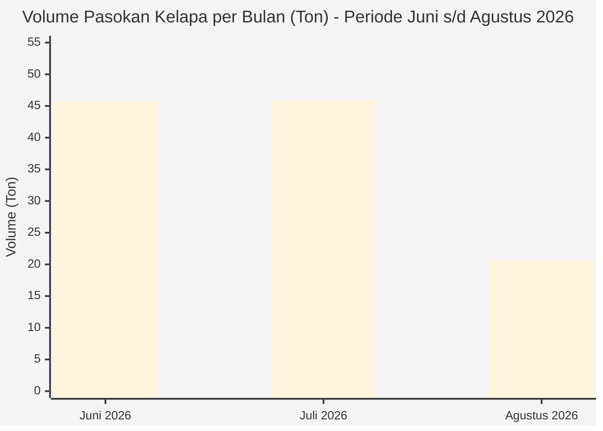
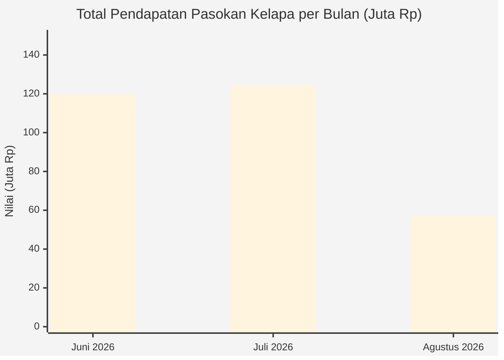
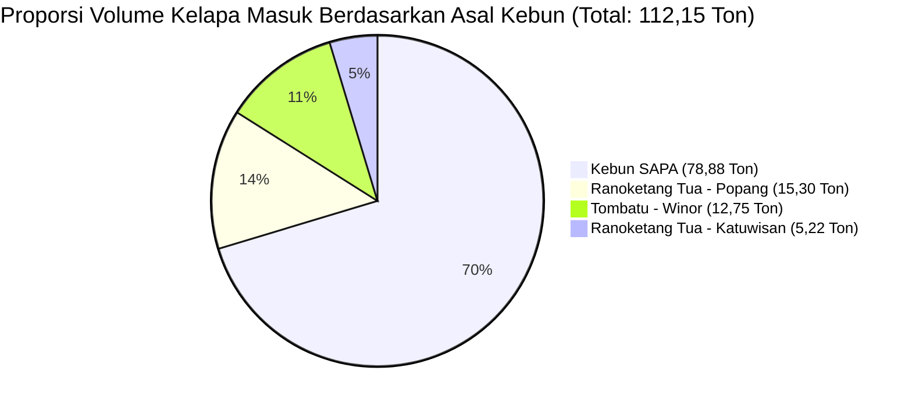
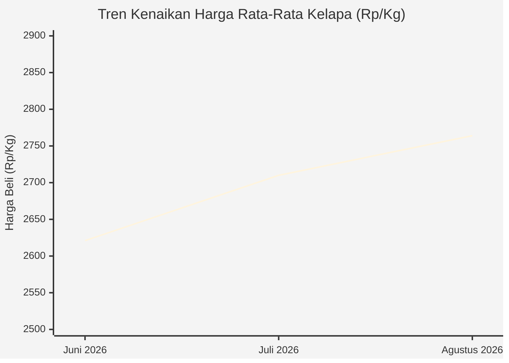

# LAPORAN PEMASUKAN KELAPA KE PT TRIMUSTIKA COCOMINAESA (TMC)
## REKAPITULASI DAN ANALISIS PRODUKSI PERKEBUNAN TMC TIGA BULAN BERJALAN
### Periode: Juni 2026 – Agustus 2026

**Unit Usaha**: Perkebunan TMC  
**Lokasi Kantor & Pabrik**: Jl. Raya A.K.D. Km. 90, Desa Teep, Kec. Amurang Barat, Kab. Minahasa Selatan, Sulawesi Utara 95924  
**Penerima Laporan**: Direksi PT Trimustika Cocominaesa & Manajemen Operasional Perkebunan  
**Klasifikasi Dokumen**: Laporan Finansial & Operasional Pasokan Bahan Baku Kelapa  
**Tanggal Rilis Dokumen**: Oktober 2026  

---

## 1. Ringkasan Eksekutif (Executive Summary)

Sepanjang triwulan berjalan periode **Juni 2026 hingga Agustus 2026**, pasokan kelapa dari unit Perkebunan TMC yang masuk ke pabrik pengolahan PT Trimustika Cocominaesa mencatatkan total volume bersih sebesar **112.150,00 Kg (112,15 Ton)** dengan akumulasi nilai penerimaan / pendapatan kotor sebesar **Rp 300.985.500,-**.

Aktivitas pasokan berlangsung dalam **33 kali pengiriman (ritase)** dengan kapasitas muatan rata-rata **3.398,48 Kg (~3,40 Ton)** per armada dan nilai rata-rata per transaksi sebesar **Rp 9.120.773,-**. Harga beli bahan baku kelapa bergerak mengalami apresiasi positif dari rata-rata **Rp 2.621,29/Kg** pada bulan Juni menjadi **Rp 2.764,40/Kg** pada bulan Agustus, dengan harga tertinggi menyentuh **Rp 2.900/Kg**.

### Ringkasan Indikator Kunci (KPI Dashboard)

| Indikator Kinerja Utama | Nilai Capaian | Keterangan & Catatan Analitis |
|:---|:---:|:---|
| **Total Volume Pasokan** | **112,15 Ton** (112.150 Kg) | Total realisasi 3 bulan berjalan (Juni – Agustus 2026) |
| **Total Nilai Pendapatan** | **Rp 300.985.500,-** | Akumulasi pendapatan perkebunan disetor ke TMC |
| **Total Frekuensi Pengiriman** | **33 Kali Pengiriman** | Rata-rata 11 pengiriman per bulan |
| **Rata-rata Muatan per Truk** | **3,40 Ton** (3.398,48 Kg) | Beban angkut armada logistik operasional |
| **Rata-rata Pendapatan per Rit** | **Rp 9.120.773,-** | Nilai likuiditas rata-rata per surat jalan pengiriman |
| **Harga Rata-rata Tertimbang** | **Rp 2.683,78 / Kg** | Setara Rp 2.683.776,- per Ton |
| **Rentang Fluktuasi Harga** | **Rp 2.500 – Rp 2.900 / Kg** | Kenaikan +16,0% dari level terendah ke tertinggi |
| **Kebun Kontributor Terbesar** | **Kebun SAPA (70,33%)** | Memasok 78,88 Ton dengan pendapatan Rp 210,52 Juta |

---

## 2. Grafik Pemasukan Kelapa Tiga Bulan Berjalan

### A. Grafik Volume Pasokan per Bulan (Ton)


### B. Grafik Pendapatan Finansial per Bulan (Juta Rupiah)


### C. Grafik Komposisi Kontribusi Tonase per Kebun Asal


### D. Grafik Dinamika Tren Harga Rata-Rata Beli Kelapa (Rp / Kg)


---

## 3. Rincian Rekapitulasi Berdasarkan Periode Bulanan

Berikut adalah rincian performa bulanan selama tiga bulan berjalan:

| Periode Bulan | Frekuensi (Rit) | Volume (Kg) | Volume (Ton) | Proporsi Vol (%) | Pendapatan (Rp) | Proporsi Nilai (%) | Rata-rata Harga (Rp/Kg) |
|:---|:---:|---:|---:|:---:|---:|:---:|:---:|
| **Juni 2026** | 13 | 45.610,00 | **45,61 Ton** | 40,67% | Rp 119.557.000,- | 39,72% | Rp 2.621,29 |
| **Juli 2026** | 13 | 45.850,00 | **45,85 Ton** | 40,88% | Rp 124.233.000,- | 41,28% | Rp 2.709,55 |
| **Agustus 2026** | 7 | 20.690,00 | **20,69 Ton** | 18,45% | Rp 57.195.500,- | 19,00% | Rp 2.764,40 |
| **TOTAL KESELURUHAN** | **33** | **112.150,00** | **112,15 Ton** | **100,00%** | **Rp 300.985.500,-** | **100,00%** | **Rp 2.683,78** |

### Analisis Kinerja Bulanan:
1. **Bulan Juni 2026 (45,61 Ton | Rp 119,56 Juta)**:
   - Pasokan bersumber dari 3 blok kebun: Sapa (27,64 Ton), Tombatu-Winor (12,75 Ton), dan Ranoketang Tua-Katuwisan (5,22 Ton).
   - Menghasilkan tingkat volume stabil dengan rerata 3,51 Ton per ritase.
   - Harga berkisar antara Rp 2.500 hingga Rp 2.700/Kg.

2. **Bulan Juli 2026 (45,85 Ton | Rp 124,23 Juta)**:
   - Volume pasokan mencapai titik puncak bulanan (45,85 Ton), meningkat tipis dibanding Juni.
   - **100% pasokan bulan Juli ditopang oleh Kebun SAPA** melalui 13 ritase konsisten sepanjang tanggal 02 hingga 30 Juli 2026.
   - Pendapatan melonjak menjadi Rp 124,23 Juta seiring naiknya rata-rata harga menjadi Rp 2.709,55/Kg.

3. **Bulan Agustus 2026 (20,69 Ton | Rp 57,20 Juta)**:
   - Pasokan awal bulan berasal dari Sapa (2 ritase awal, 5,39 Ton), dilanjutkan pasokan intensif dari blok Ranoketang Tua - Popang sebanyak 5 ritase (15,30 Ton) pada kurun 22–29 Agustus 2026.
   - Terjadi kenaikan harga signifikan hingga menyentuh level tertinggi **Rp 2.900/Kg** pada akhir Agustus, mencerminkan tingginya permintaan pasar bahan baku industri kelapa di Minahasa Selatan.

---

## 4. Rincian Rekapitulasi Berdasarkan Asal Blok Perkebunan

| No | Nama Blok Kebun Asal | Frekuensi (Rit) | Volume (Kg) | Volume (Ton) | Kontribusi Vol (%) | Total Pendapatan (Rp) | Kontribusi Nilai (%) | Rentang Harga (Rp/Kg) | Rata-rata Harga (Rp/Kg) |
|:--:|:---|:---:|---:|---:|:---:|---:|:---:|:---:|---:|
| 1 | **SAPA** | 23 | 78.880,00 | **78,88 Ton** | 70,33% | Rp 210.524.500,- | 69,94% | Rp 2.500 – Rp 2.850 | Rp 2.668,92 |
| 2 | **RANOKETANG TUA - POPANG** | 5 | 15.300,00 | **15,30 Ton** | 13,64% | Rp 42.826.000,- | 14,23% | Rp 2.700 – Rp 2.900 | Rp 2.799,08 |
| 3 | **TOMBATU - WINOR** | 3 | 12.750,00 | **12,75 Ton** | 11,37% | Rp 34.425.000,- | 11,44% | Rp 2.700 | Rp 2.700,00 |
| 4 | **RANOKETANG TUA - KATUWISAN** | 2 | 5.220,00 | **5,22 Ton** | 4,65% | Rp 13.210.000,- | 4,39% | Rp 2.500 – Rp 2.600 | Rp 2.530,65 |
| **TOTAL** | **SEMUA BLOK KEBUN** | **33** | **112.150,00** | **112,15 Ton** | **100,00%** | **Rp 300.985.500,-** | **100,00%** | **Rp 2.500 – Rp 2.900** | **Rp 2.683,78** |

### Matriks Distribusi Silang Kebun per Bulan:

```
+-----------------------------+-------------------+-------------------+-------------------+--------------------+
| Blok Perkebunan             | Juni 2026         | Juli 2026         | Agustus 2026      | Total Akumulasi    |
+-----------------------------+-------------------+-------------------+-------------------+--------------------+
| SAPA                        | 27,64 Ton         | 45,85 Ton         |  5,39 Ton         |  78,88 Ton         |
|                             | (Rp 71,92 Juta)   | (Rp 124,23 Juta)  | (Rp 14,37 Juta)   | (Rp 210,52 Juta)   |
|                             | 8 Transaksi       | 13 Transaksi      | 2 Transaksi       | 23 Transaksi       |
+-----------------------------+-------------------+-------------------+-------------------+--------------------+
| RANOKETANG TUA - POPANG     | -                 | -                 | 15,30 Ton         |  15,30 Ton         |
|                             | -                 | -                 | (Rp 42,83 Juta)   | (Rp 42,83 Juta)    |
|                             | -                 | -                 | 5 Transaksi       |  5 Transaksi       |
+-----------------------------+-------------------+-------------------+-------------------+--------------------+
| TOMBATU - WINOR             | 12,75 Ton         | -                 | -                 |  12,75 Ton         |
|                             | (Rp 34,43 Juta)   | -                 | -                 | (Rp 34,43 Juta)    |
|                             | 3 Transaksi       | -                 | -                 |  3 Transaksi       |
+-----------------------------+-------------------+-------------------+-------------------+--------------------+
| RANOKETANG TUA - KATUWISAN  |  5,22 Ton         | -                 | -                 |   5,22 Ton         |
|                             | (Rp 13,21 Juta)   | -                 | -                 | (Rp 13,21 Juta)    |
|                             | 2 Transaksi       | -                 | -                 |  2 Transaksi       |
+-----------------------------+-------------------+-------------------+-------------------+--------------------+
| TOTAL BULANAN               | 45,61 Ton         | 45,85 Ton         | 20,69 Ton         | 112,15 Ton         |
|                             | (Rp 119,56 Juta)  | (Rp 124,23 Juta)  | (Rp 57,20 Juta)   | (Rp 300,99 Juta)   |
|                             | 13 Transaksi      | 13 Transaksi      | 7 Transaksi       | 33 Transaksi       |
+-----------------------------+-------------------+-------------------+-------------------+--------------------+
```

---

## 5. Rincian Lengkap Seluruh 33 Transaksi Pengiriman Kelapa

Berikut adalah pembukuan lengkap seluruh surat penerimaan pasokan kelapa (*Nota Penerimaan / NP*) dari unit Perkebunan TMC ke PT Trimustika Cocominaesa:

| No | Tanggal | Asal Kebun | Nomor Referensi (No Ref) | Kuantitas (Kg) | Tonase (Ton) | Harga Satuan (Rp/Kg) | Total Nilai Penerimaan (Rp) |
|:--:|:---:|:---|:---|---:|---:|---:|---:|
| 1 | 03-Jun-26 | SAPA | 88-NP-03-06-2026 | 3.710,00 | 3,71 Ton | Rp 2.700 | Rp 10.017.000 |
| 2 | 05-Jun-26 | SAPA | 129-NP-05-06-2026 | 3.130,00 | 3,13 Ton | Rp 2.500 | Rp 7.825.000 |
| 3 | 06-Jun-26 | RANOKETANG TUA - KATUWISAN | 155-NP-06-06-2026 | 3.620,00 | 3,62 Ton | Rp 2.500 | Rp 9.050.000 |
| 4 | 09-Jun-26 | SAPA | 248-NP-09-06-2026 | 3.630,00 | 3,63 Ton | Rp 2.600 | Rp 9.438.000 |
| 5 | 10-Jun-26 | SAPA | 279-NP-10-06-2026 | 3.420,00 | 3,42 Ton | Rp 2.600 | Rp 8.892.000 |
| 6 | 10-Jun-26 | RANOKETANG TUA - KATUWISAN | 283-NP-10-06-2026 | 1.600,00 | 1,60 Ton | Rp 2.600 | Rp 4.160.000 |
| 7 | 15-Jun-26 | SAPA | 361-NP-15-06-2026 | 2.990,00 | 2,99 Ton | Rp 2.600 | Rp 7.774.000 |
| 8 | 18-Jun-26 | SAPA | 479-NP-18-06-2026 | 3.520,00 | 3,52 Ton | Rp 2.600 | Rp 9.152.000 |
| 9 | 20-Jun-26 | SAPA | 534-NP-20-06-2026 | 3.600,00 | 3,60 Ton | Rp 2.600 | Rp 9.360.000 |
| 10 | 24-Jun-26 | TOMBATU - WINOR | 618-NP-24-06-2026 | 3.500,00 | 3,50 Ton | Rp 2.700 | Rp 9.450.000 |
| 11 | 25-Jun-26 | TOMBATU - WINOR | 647-NP-25-06-2026 | 3.450,00 | 3,45 Ton | Rp 2.700 | Rp 9.315.000 |
| 12 | 25-Jun-26 | TOMBATU - WINOR | 625-NP-25-06-2026 | 5.800,00 | 5,80 Ton | Rp 2.700 | Rp 15.660.000 |
| 13 | 26-Jun-26 | SAPA | 664-NP-26-06-2026 | 3.640,00 | 3,64 Ton | Rp 2.600 | Rp 9.464.000 |
| 14 | 02-Jul-26 | SAPA | 53 -NP-02-07-2026 | 3.600,00 | 3,60 Ton | Rp 2.700 | Rp 9.720.000 |
| 15 | 04-Jul-26 | SAPA | 120 -NP-04-07-2026 | 3.630,00 | 3,63 Ton | Rp 2.700 | Rp 9.801.000 |
| 16 | 07-Jul-26 | SAPA | 179 -NP-07-07-2026 | 3.670,00 | 3,67 Ton | Rp 2.750 | Rp 10.092.500 |
| 17 | 08-Jul-26 | SAPA | 218 -NP-08-07-2026 | 3.610,00 | 3,61 Ton | Rp 2.600 | Rp 9.386.000 |
| 18 | 09-Jul-26 | SAPA | 245 -NP-09-07-2026 | 3.190,00 | 3,19 Ton | Rp 2.600 | Rp 8.294.000 |
| 19 | 17-Jul-26 | SAPA | 449 -NP-17-07-2026 | 3.390,00 | 3,39 Ton | Rp 2.700 | Rp 9.153.000 |
| 20 | 18-Jul-26 | SAPA | 493 -NP-18-07-2026 | 1.760,00 | 1,76 Ton | Rp 2.700 | Rp 4.752.000 |
| 21 | 22-Jul-26 | SAPA | 565 -NP-22-07-2026 | 3.540,00 | 3,54 Ton | Rp 2.750 | Rp 9.735.000 |
| 22 | 23-Jul-26 | SAPA | 597 -NP-23-07-2026 | 3.730,00 | 3,73 Ton | Rp 2.850 | Rp 10.630.500 |
| 23 | 24-Jul-26 | SAPA | 626 -NP-24-07-2026 | 3.960,00 | 3,96 Ton | Rp 2.750 | Rp 10.890.000 |
| 24 | 28-Jul-26 | SAPA | 722 -NP-28-07-2026 | 3.860,00 | 3,86 Ton | Rp 2.700 | Rp 10.422.000 |
| 25 | 29-Jul-26 | SAPA | 746 -NP-29-07-2026 | 3.960,00 | 3,96 Ton | Rp 2.700 | Rp 10.692.000 |
| 26 | 30-Jul-26 | SAPA | 775 -NP-30-07-2026 | 3.950,00 | 3,95 Ton | Rp 2.700 | Rp 10.665.000 |
| 27 | 03-Agt-26 | SAPA | 33 -NP-03-08-2026 | 3.670,00 | 3,67 Ton | Rp 2.650 | Rp 9.725.500 |
| 28 | 04-Agt-26 | SAPA | 91 -NP-04-08-2026 | 1.720,00 | 1,72 Ton | Rp 2.700 | Rp 4.644.000 |
| 29 | 22-Agt-26 | RANOKETANG TUA - POPANG | 617 -NP-22-08-2026 | 3.080,00 | 3,08 Ton | Rp 2.700 | Rp 8.316.000 |
| 30 | 24-Agt-26 | RANOKETANG TUA - POPANG | 648 -NP-24-08-2026 | 3.120,00 | 3,12 Ton | Rp 2.700 | Rp 8.424.000 |
| 31 | 24-Agt-26 | RANOKETANG TUA - POPANG | 682 -NP-26-08-2026 | 3.040,00 | 3,04 Ton | Rp 2.800 | Rp 8.512.000 |
| 32 | 28-Agt-26 | RANOKETANG TUA - POPANG | 732 -NP-28-08-2026 | 3.000,00 | 3,00 Ton | Rp 2.900 | Rp 8.700.000 |
| 33 | 29-Agt-26 | RANOKETANG TUA - POPANG | 769 -NP-29-08-2026 | 3.060,00 | 3,06 Ton | Rp 2.900 | Rp 8.874.000 |
| **TOTAL** | **JUNI - AGUSTUS 2026** | **33 PENGIRIMAN** | **REKAPITULASI RESMI** | **112.150,00** | **112,15 Ton** | **Rata: 2.684** | **Rp 300.985.500** |

---

## 6. Catatan Operasional & Kesimpulan Strategis

1. **Keandalan Pasokan Mandiri**:
   - Pasokan dari kebun-kebun internal Perkebunan TMC (khususnya Blok Sapa) terbukti menjadi penopang stabilitas bahan baku kelapa berkualitas bagi pabrik PT Trimustika Cocominaesa di tengah persaingan serapan kelapa dengan industri sekitar (PT Sasa Inti, PT Cargill, PT KJL).
2. **Efisiensi Logistik & Angkutan**:
   - Armada pengangkut beroperasi efektif pada kapasitas 3,0 – 3,9 Ton/ritase, dengan satu pengiriman khusus kapasitas besar mencapai 5,80 Ton dari Tombatu - Winor.
3. **Optimasi Pendapatan Perkebunan**:
   - Tingkat harga jual perkebunan ke pabrik mengalami kenaikan sehat dari rata-rata Rp 2.621/Kg ke Rp 2.764/Kg sejalan dengan tren pasar komoditas kelapa di Sulawesi Utara, menghasilkan arus kas penerimaan bruto lebih dari **Rp 300,98 Juta** selama 3 bulan berjalan.
